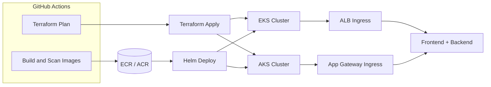
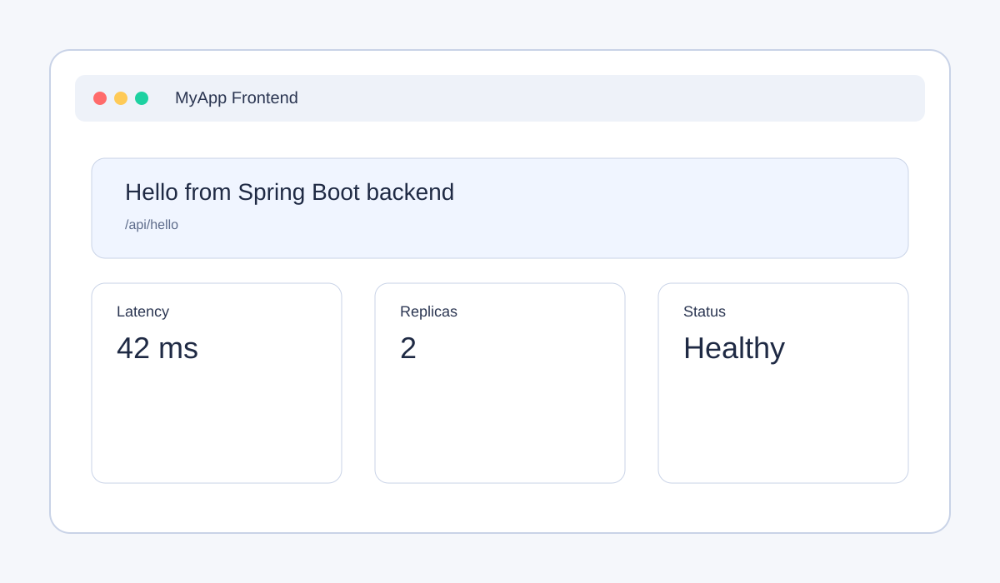
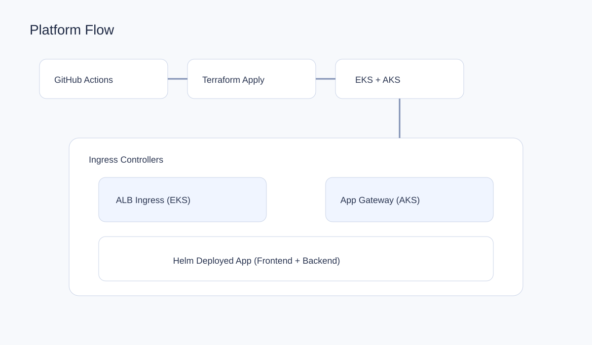

# Multi-Cloud Kubernetes Platform (AWS EKS + Azure AKS)

[](https://github.com/dbk1337/multi-cloud-k8s-platform/actions/workflows/build-and-push.yml)
[](https://github.com/dbk1337/multi-cloud-k8s-platform/actions/workflows/quality-checks.yml)
[](https://github.com/dbk1337/multi-cloud-k8s-platform/actions/workflows/quality-checks.yml)
[](https://github.com/dbk1337/multi-cloud-k8s-platform/actions/workflows/terraform.yml)
[](LICENSE)

Production-style reference platform that provisions Kubernetes in AWS and Azure with Terraform and deploys a simple backend + frontend via Helm. This repo is designed as a portfolio-grade example for DevOps and platform engineering work.

## What this repo delivers
- Multi-cloud IaC with Terraform for EKS and AKS
- IRSA and cloud-native ingress controllers (ALB and Application Gateway)
- Containerized backend (Spring Boot) and frontend (React + Nginx)
- Helm chart for repeatable Kubernetes deployment
- GitHub Actions for build, OIDC auth, quality checks, and Terraform plan
- IaC linting and security scans with tflint, checkov, and tfsec

## Repository layout
```text
.
  .github/
    workflows/
  app/                 Application source code
    backend/           Spring Boot API
    frontend/          React UI
  helm/                Helm chart for Kubernetes deployment
    myapp/
  terraform/           AWS and Azure infrastructure
    aws/
    azure/
    environments/
```

## Architecture


## Screenshots



## Design decisions
- Use IRSA to avoid static AWS credentials inside the cluster.
- Use managed ingress controllers (ALB, App Gateway) for L7 routing.
- Keep the app stateless and probe-friendly for Kubernetes health checks.
- Keep Terraform modules flat for clarity and portability.

## Quickstart (local)
Backend:
```bash
cd app/backend
mvn clean package
mvn spring-boot:run
```

Frontend (uses CRA proxy to the backend):
```bash
cd app/frontend
npm install
npm start
```

## Build container images
```bash
docker build -t myapp-backend:local app/backend
docker build -t myapp-frontend:local app/frontend
```

## Helm deploy
```bash
helm upgrade --install demo-app helm/myapp \
  -f helm/myapp/values.yaml \
  --namespace default \
  --create-namespace
```

Cloud-specific values:
```bash
# AWS
helm upgrade --install demo-app helm/myapp -f helm/myapp/values-eks.yaml

# Azure
helm upgrade --install demo-app helm/myapp -f helm/myapp/values-azure.yaml
```

The frontend calls `/api/hello` on the same host. If you need a different API host, build the frontend image with `REACT_APP_BACKEND_URL`:
```bash
docker build -t myapp-frontend:local \
  --build-arg REACT_APP_BACKEND_URL=https://api.example.com \
  app/frontend
```

## Configuration and secrets
Local/dev (copy `.env.example` to `.env`):
- `REACT_APP_BACKEND_URL` for the frontend build
- `AWS_REGION` and `AWS_PROFILE` for AWS CLI usage
- `AZURE_SUBSCRIPTION_ID`, `AZURE_TENANT_ID`, `AZURE_CLIENT_ID` for Azure CLI usage

CI (GitHub Actions secrets for OIDC):
- `AWS_ROLE_ARN`
- `AZURE_CLIENT_ID`
- `AZURE_TENANT_ID`
- `AZURE_SUBSCRIPTION_ID`

## Terraform usage
See `terraform/README.md` for full setup steps and environment examples. Helper scripts are available:
```bash
cd terraform
./deploy-aws.sh plan dev
./deploy-azure.sh plan dev
```

## How to run (copy/paste)
AWS (EKS):
```bash
cd terraform/aws
terraform init
terraform plan -var-file=../environments/dev/aws.tfvars
terraform apply -var-file=../environments/dev/aws.tfvars
aws eks update-kubeconfig --region us-east-1 --name my-eks-cluster-dev
helm upgrade --install demo-app ../../helm/myapp \
  -f ../../helm/myapp/values-eks.yaml \
  --namespace default \
  --create-namespace
```

Azure (AKS):
```bash
cd terraform/azure
terraform init
terraform plan -var-file=../environments/dev/azure.tfvars
terraform apply -var-file=../environments/dev/azure.tfvars
az aks get-credentials --resource-group my-aks-rg-dev --name my-aks-cluster-dev
helm upgrade --install demo-app ../../helm/myapp \
  -f ../../helm/myapp/values-azure.yaml \
  --namespace default \
  --create-namespace
```

## Sample outputs
Terraform plan (trimmed):
```text
Terraform will perform the following actions:

  # aws_eks_cluster.main will be created
  + resource "aws_eks_cluster" "main" {
      name = "my-eks-cluster-dev"
    }

Plan: 12 to add, 0 to change, 0 to destroy.
```

Helm template (trimmed):
```yaml
apiVersion: apps/v1
kind: Deployment
metadata:
  name: demo-app-backend
spec:
  replicas: 2
  template:
    spec:
      containers:
        - name: backend
          image: myapp-backend:latest
```

## CI/CD
GitHub Actions workflows are in `.github/workflows`:
- Image build and push for backend/frontend
- Quality checks (Trivy, tfsec, CodeQL, SonarCloud)
- Terraform plan for AWS and Azure
All workflows require a self-hosted GitHub runner with the `onprem` label.

## License
MIT. See `LICENSE`.
